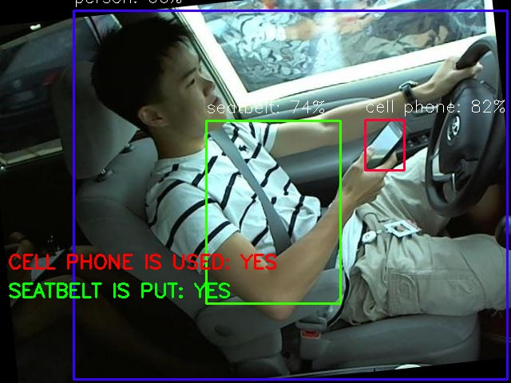

# Driver Computer Vision

Реализован следующий функционал:

1.	Определение спящих водителей.
Человек спит, если его глаза закрыты в течение какого-то времени для последовательности кадров видеозаписи. Чтобы определить, закрыты глаза или нет, используется метод соотношения сторон глаз (EAR). Для вычисления EAR предварительно извлекаются ключевые точки в области глаз с помощью решения mediapipe.

2.	Определение использования водителем телефона.
Для определения в кадре телефона используется модель YOLOv5, которая подходит для работы в режиме реальном времени и на портативных устройствах.

3.	Проверка наличия ремня безопасности.
Также используется модель YOLOv5. Дополнительно из https://roboflow.com/ собран датасет более 2 тысяч изображений для последующего обучения модели.

Пример результата работы скрипта:



Параметры запуска скрипта для видеозаписи (формат mp4):
```
python run.py --data_type video --file_path test_video.mp4
```
Параметры запуска скрипта для изображения (форматы png, jpg):
```
python run.py --data_type image --file_path test_image.png
```
